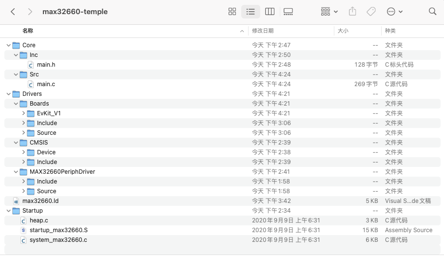

eclipse工程移植到Clion
==
<p align="right">以美信MAX32660为例</p>
--
注：此教程默认你有使用CLion编写STM32程序经验
## 1. 安装芯片厂商对应的eclipse
安装途中会下载工具链、OpenOCD、Eclipse和固件库，国内由于各种因素，下载可能较慢，记得在安装界面的设置里设置代理


## 2. 找出库的位置，并复制出来一份
美信MAX32660的库在安装目录\Firmware\Libraries中


Board为BSP板级支持层，主要帮你写了串口和LED的初始化和各种设定，不需要可以不用，需要的话由于本次活动使用的板卡是MAX32660-EVSYS而非MAXREFDES300#，故不需要复制MAXREFDES300文件夹

CMSIS文件夹为CMSIS标准提供的文件和厂商适配CMSIS标准编写的文件，全部复制

FreeRTOS和Plus为FreeRTOS v1和v2，本次暂时不使用操作系统，故不复制

MAX32660PeriphDriver为美信提供的库函数，全部复制

按照个人习惯摆放好文件位置，我摆放成了类似于STM32Cube生成的工程的样子。其中启动文件和链接文件在Libraies\CMSIS\Device\Maxim\MAX32660\Source下，我将他们移了出来。然后删除所有.mk文件，这些文件对于Clion所使用的cmake是没有必要的。



## 3. 使用Clion打开工程

打开这个复制好的文件夹，随便打开一个文件，选择右上角的创建CMakeLists.txt


直接确认即可，因为我们还要手动对这个cmakelists文件进行改动，我们主要参考STM32Cube工程使用Clion打开所生成的Cmakelists

* 删除最下面的`add_executable`
* 检查一下使用`include_directories`命令包含的头文件的文件夹是否齐全
* 在文件开头添加：
```cmake
set(CMAKE_SYSTEM_NAME Generic)
set(CMAKE_SYSTEM_VERSION 1)
```
* 在`project`命令之前指定编译器：
```cmake
set(CMAKE_C_COMPILER arm-none-eabi-gcc)
set(CMAKE_CXX_COMPILER arm-none-eabi-g++)
set(CMAKE_ASM_COMPILER  arm-none-eabi-gcc)
set(CMAKE_AR arm-none-eabi-ar)
set(CMAKE_OBJCOPY arm-none-eabi-objcopy)
set(CMAKE_OBJDUMP arm-none-eabi-objdump)
set(SIZE arm-none-eabi-size)
set(CMAKE_TRY_COMPILE_TARGET_TYPE STATIC_LIBRARY)
```
* `project`命令添加参数使其支持汇编代码
```cmake
project(max32660_temple C CXX ASM)
```
* `project`下删除指定C++版本的`set`命令并重新指定c/c++的版本（不局限于样例重的c11和c++17）
```cmake
set(CMAKE_CXX_STANDARD 17)
set(CMAKE_C_STANDARD 11)
```
* 添加编译参数，编译参数可从以下几个地方找到
  + makefile文件
  + eclipse编译时的命令行
  + eclipse项目的Properties-C/C++ Settings-Tool Settings中（不知为何这个美信提供的eclipse中没有）
  
  
  
  
  可自行查阅每个参数的意义，参考代码如下：
```cmake
add_compile_options(-mfloat-abi=hard -mfpu=fpv4-sp-d16 -Wa,-mimplicit-it=thumb)
add_compile_options(-mcpu=cortex-m4 -mthumb )
add_compile_options(-fsingle-precision-constant -ffunction-sections -fdata-sections )
add_compile_options(-Wall -Wdouble-promotion -Wno-format -fno-isolate-erroneous-paths-dereference)
add_compile_options(-Og -g3 -ggdb)

add_definitions(-DTARGET=32660 -DTARGET_REV=0x4131 -DDEBUG -DMXC_ASSERT_ENABLE -DRO_FREQ=80000000)
```
* 设置源文件、链接文件
```cmake
file(GLOB_RECURSE SOURCES "Startup/*.*" "Drivers/*.*" "Core/*.*")
set(LINKER_SCRIPT ${CMAKE_SOURCE_DIR}/max32660.ld)
```
* 设置链接参数
  + 添加编译参数中-m开头部分参数
  + 引入map文件，makefile中使用xlinker引入，我这边照抄STM32工程使用-Wl引入
  + 引入编译脚本
```cmake
add_link_options(-mthumb -mcpu=cortex-m4 -mfloat-abi=hard -mfpu=fpv4-sp-d16)
add_link_options(-Wl,-gc-sections,--print-memory-usage,-Map=${PROJECT_BINARY_DIR}/${PROJECT_NAME}.map)
add_link_options(-T ${LINKER_SCRIPT})
```
* 最后就是生成我们的elf/hex/bin了，其中elf必须有，hex和bin按需选择
```cmake
add_executable(${PROJECT_NAME}.elf ${SOURCES} ${LINKER_SCRIPT})

set(HEX_FILE ${PROJECT_BINARY_DIR}/${PROJECT_NAME}.hex)
set(BIN_FILE ${PROJECT_BINARY_DIR}/${PROJECT_NAME}.bin)

add_custom_command(TARGET ${PROJECT_NAME}.elf POST_BUILD
        COMMAND ${CMAKE_OBJCOPY} -Oihex $<TARGET_FILE:${PROJECT_NAME}.elf> ${HEX_FILE}
        COMMAND ${CMAKE_OBJCOPY} -Obinary $<TARGET_FILE:${PROJECT_NAME}.elf> ${BIN_FILE}
        COMMENT "Building ${HEX_FILE}
Building ${BIN_FILE}")
```

总览


编写完成后右上角重新加载变更，此时编译的话可能会显示收集编译器信息时遇到问题。
## 4.更换编译器
打开CLion的设置，选择“构建、执行、部署”-“工具链”，添加一条arm-gcc的工具链


在CMake中将Debug的工具链改为新添加的工具链


确定后点击左上角的锤子，应该就可以正常编译了
## 5.配置下载
这里我们使用openocd下载，和STM32一样。

我这边推荐直接翻找出美信的openocd并调用，因为我尝试复制cfg文件并使用自己的openocd时会有一些问题。

美信的openocd文件在Toolchain\bin下，直接在clion里面引用这个openocd即可


左上角的配置框下拉选择编辑配置，添加一个openocd下载并运行


面板配置文件选择Toolchain\share\openocd\scripts\target\max32660.cfg即可
